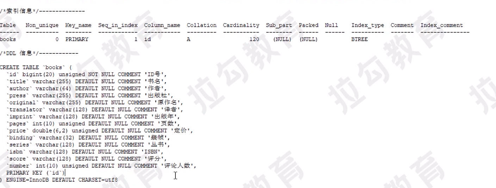
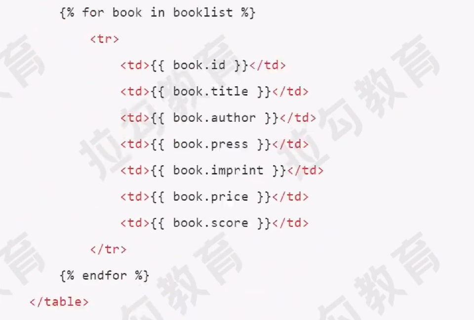
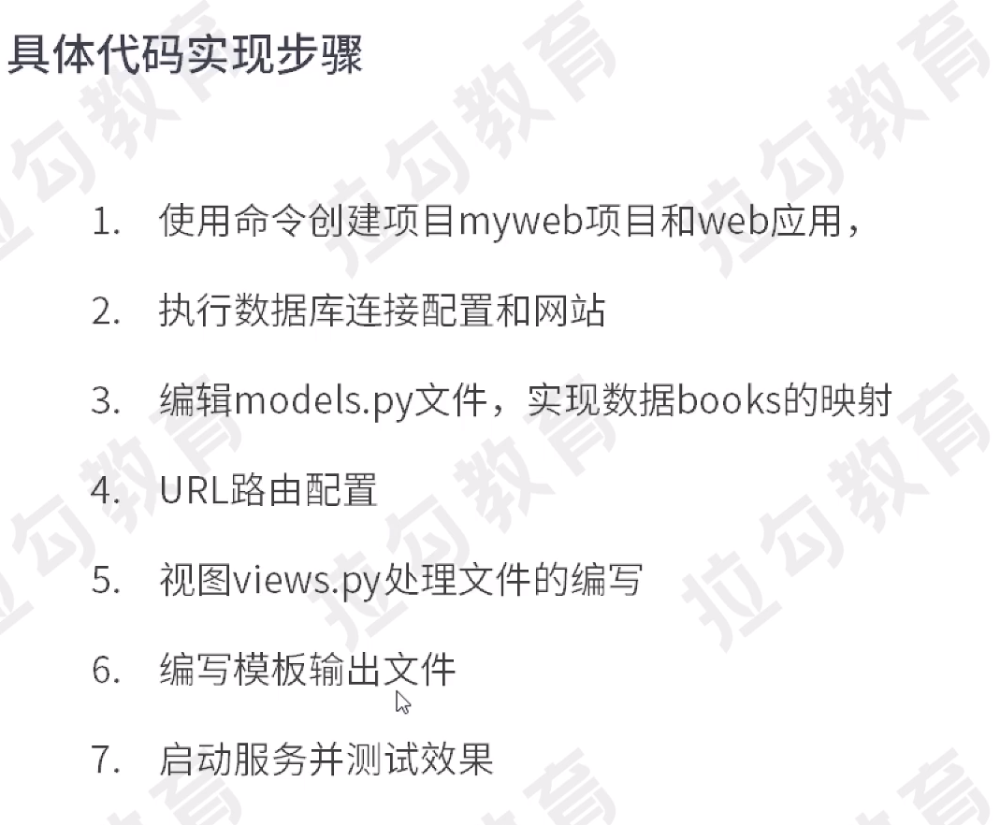

# 创建项目框架myweb:生成myweb文件夹
django-admin startproject myweb

# 进入项目目录
cd myweb

# 在项目中创建一个web应用：生产web文件夹
python manage.py startapp web

# 创建模板目录:在此目录下创建app目录web
mkdir templates

# 编辑myweb/settings.py文件，配置数据库连接
## 配置自己服务器的IP地址
ALLOWED_HOSTS = [‘×’]

## 添加自己应用
INSTALLED_APPS = [‘web’]

## 配置模板路径信息
TEMPLATES
DIRS:[os.path.join(BASE_DIR,'templates'')],

## 配置数据库连接配置
DATABASE = {
    'default':{
        'ENGINE':'django,db,backends.mysql',
        'NAME':'doubandb',
        'USER':'root',
        'PASSWORD':'',
        'HOST':'localhost',
        'PORT':'3306',
    }
}

# 定义Model类
## 编辑myweb/web/models.py
```python
from django.db import models

#图书信息模型
class Books(models.Model):
    title = models.CharField(max_length=255)#书名
    author = models.CharField(max_length=64)#作者
    press = models.CharField(max_length=255)#出版社
    origin = models.CharField(max_length=255)#原作名
    price = models.FloatField()#定价

class Meta:
    db_table = "books" #更改表名
```
## 数据库信息


# URL路由配置
## 编辑myweb/myweb/urls.py根路由配置文件
```python
from django.urls import include,path

urlpatterns = [
    path('',include("web.urls")),
]
```

## 创建web子路由文件：myweb/web/urls.py
```python
from django.urls import path
from . import views

urlpatterns = [
    path('',views.index,name="index")
    path('/',views.index,name="index")    
]
```

# 编写视图

```python
from django.shortcuts import render
from django.core.paginator import Paginator
from web.models import Books


def index(request):
    # 获取商品信息查询对象
    mod = Books.objects
    list = mod.filter()
    
    # 执行分页处理
    pIndex = int(request.GET.get("p",1))
    page = Paginator(list,50)# 以50条每页创建分页对象
    maxpages = page.num_pages #最大页数
    #判断页数是否越界
    if pIndex > maxpages:
        pIndex = maxpages
    if pIndex < 1 :
        pIndex=1
    list2 = page.page(pIndex)#当前页数据
    plist = page.page_range #页码数列表
    
    #封装信息加载模块输出
    context = {"booklist":'list2',"plist":'pIndex',"maxpage":'maxxpage'}
    return render(request,"web/index.html",context)
```

# 编写模板输出文件
```html
<!doctype html>
<html lang="en">
<head>
<meta charset="UTF-8">
             <meta name="viewport" content="width=device-width, user-scalable=no, initial-scale=1.0, maximum-scale=1.0, minimum-scale=1.0">
                         <meta http-equiv="X-UA-Compatible" content="ie=edge">
             <title>Document</title>
</head>
<body>
  
</body>
</html>
```





# 运行
python manage.py runserver

# 缺少库
pip install mysqlclient

